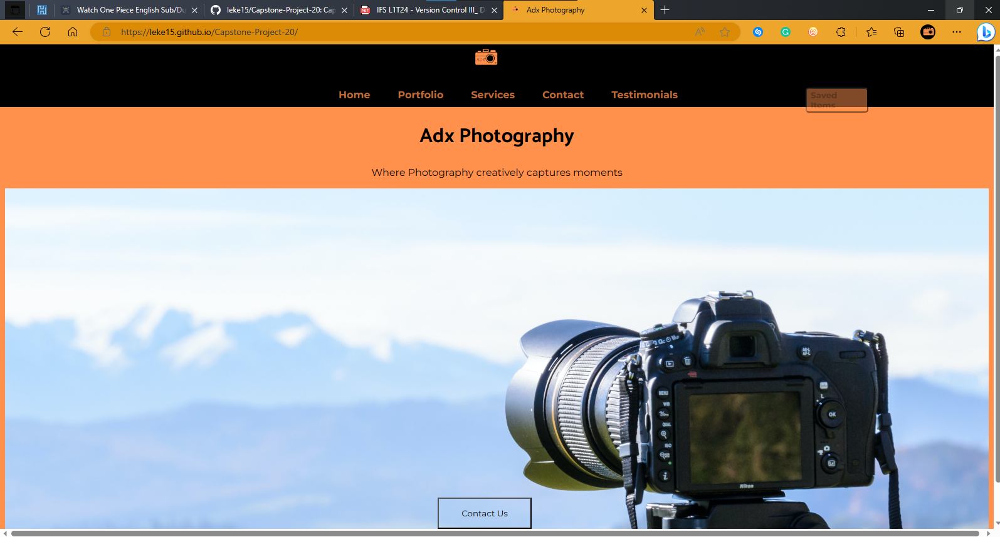
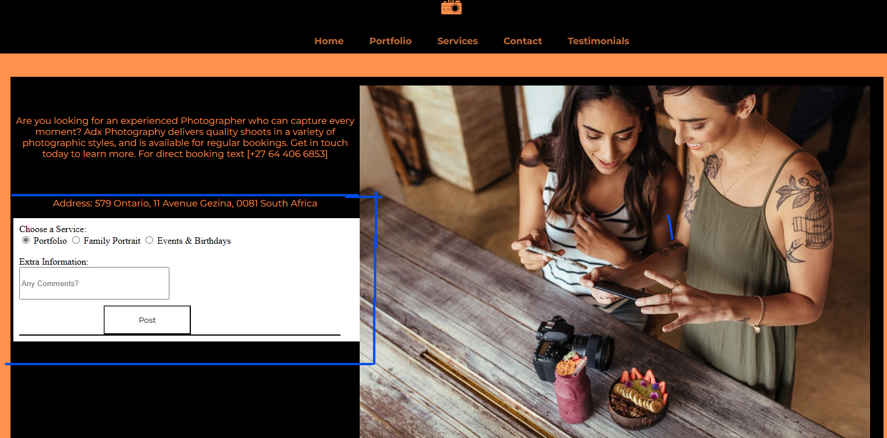

# Capstone-Project-20
Capstone for Hyperion Dev project 20 building a website using jquery, to showcase my skills I created a dummy website of my photography website. You can like images, and they will be added to the saved images pages, this also shows a little of my skills in saving local storage sessions. Comments can be added as well on the contact page.

# Getting it on your local repository
Copy this project's github URL and Clone the project like this:
`git clone https://github.com/leke15/Capstone-Project-20.git`, the project will be automatically added to your local repository.
what you should see when it's done copying in your repo.
>.

# How to Open/Use the Website
The file you want to open is the homepage
`index.html.`
> When you open the page you should see this:
> 
## Jquery Elements
There are certain elements that I made with jquery, These include:
- > Saved Items button
- > The services drop-down menu
- > The contact us button on the homepage

## Liked and Unliked Images
When you open the portfolio page you will see a gallery of images in each one, there is a heart Icon ❤️ which is not as red as the previously shown one but when clicked on it becomes the red heart and automatically gets added to the saved page. 
> If you want to remove the image from the saved page just click on the heart icon again.
## Making Comments
If you want to make a comment go to the contact page the page has a section for comments and it can be specified for a particular service.
What you should see when you open the page
> 
